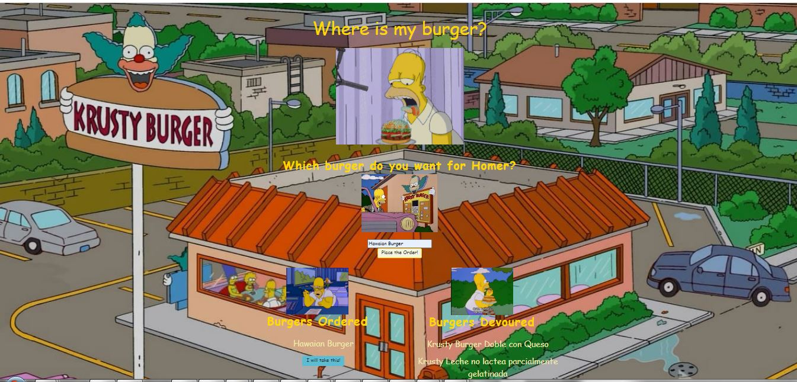

# Eat the Burger

## Overview

* You can enter a burger and it will appear in the first list ready to be devoured by Homer, once Home has eaten the burger it will appear in the second list.
* The app has a MySQL database where the burgers requested are added
* Using Express the controller is created to communicate with the DB and insert or update the burger 
* With handlebars the pages were developed to display the DB information

## Technologies used to develop the app
- HTML5
- CSS3
- Bootstrap
- Javascript
- JQuery
- JSON
- Node.js
- Express.js
- Handlebars.js
- ORM
- MySQL
- Heroku

## App Link
https://jfsilvah-friendfinder.herokuapp.com/

## Author
ISC Francisco Silva
